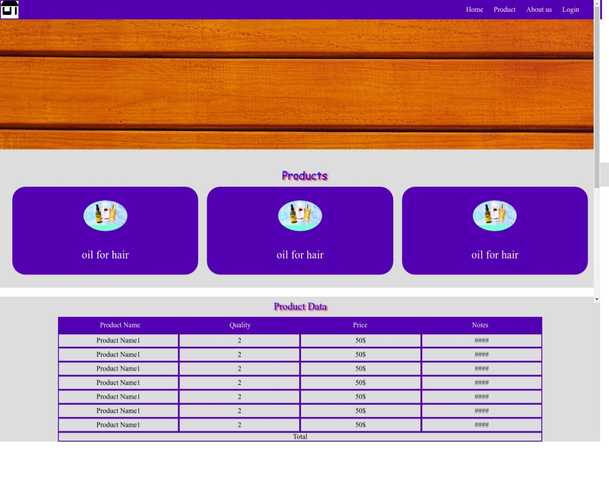
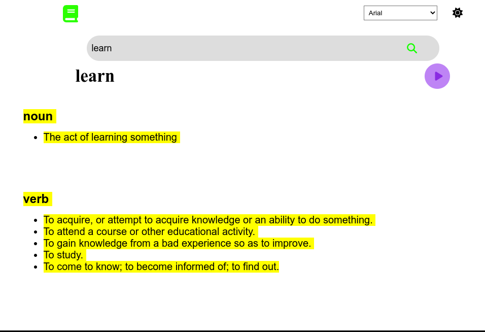
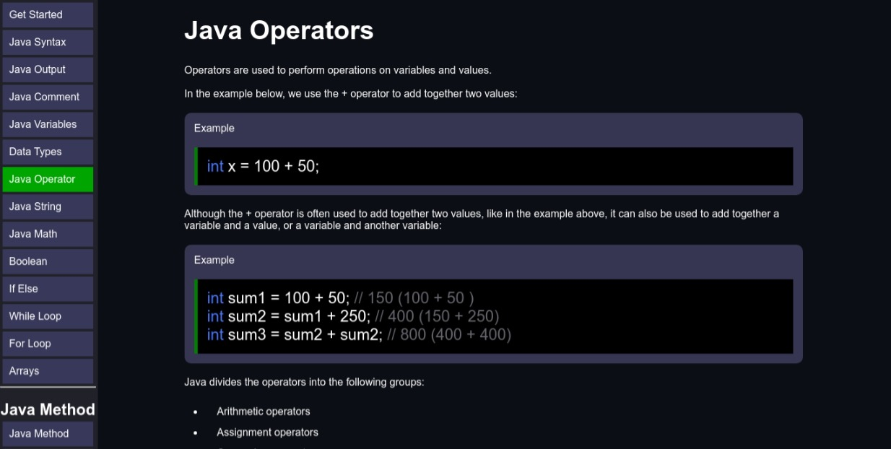
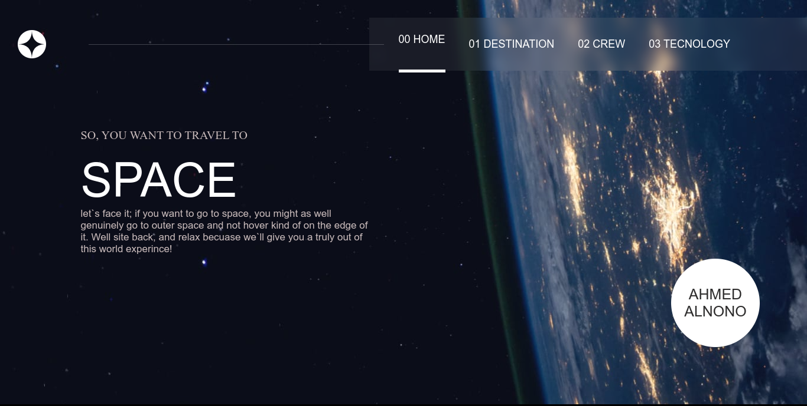
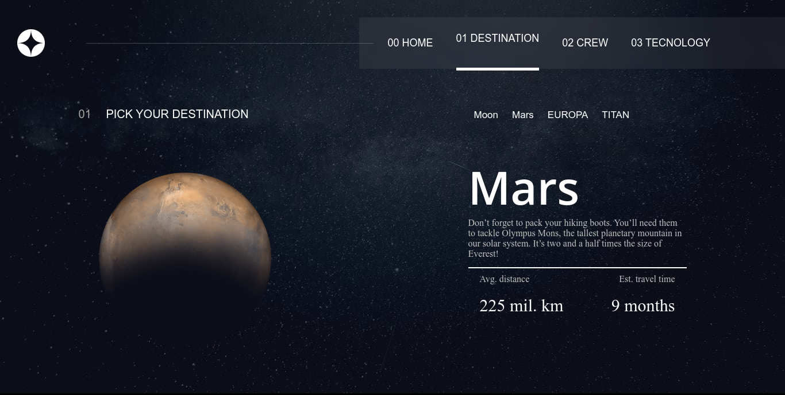
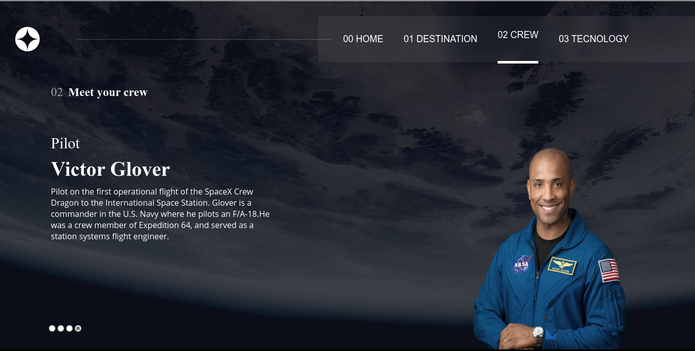
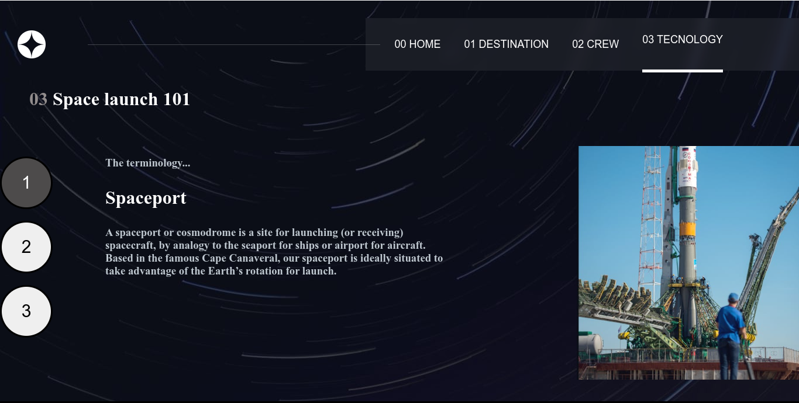

# My js project
##### i put in this repo some of my frontend project tha made with (html css and js) 

#### this projects is simple not complex 

the projects is 
- shope app
- university app
- very simple calculator
- Dectinary app
- drag&drop lesson
- paper rock game
- website to learn java
- qrcode website
- quize app with js
- travel to space plan website
- test typing website
- shorter links project

all project is simple with simple design

# project degign
all my project photo and pages and design 
here
# shope app 

 
 
 
 
 
 

# university website
## Home page

## About page

## courses page

## files page 

## contact page

 
 
 
 
 

# Dectinary app
## main page

 
 
 
 
 

# rock paper scissors game
## main page

## second page

 
 
 
 
 

# webiste to learn java

 
 
 
 
 

# space web site

## home page

## DESTINATION

## Crew 

## Technology

 
 
 
 
 

# test typing
## main page
 

# url shortin api
## main page
